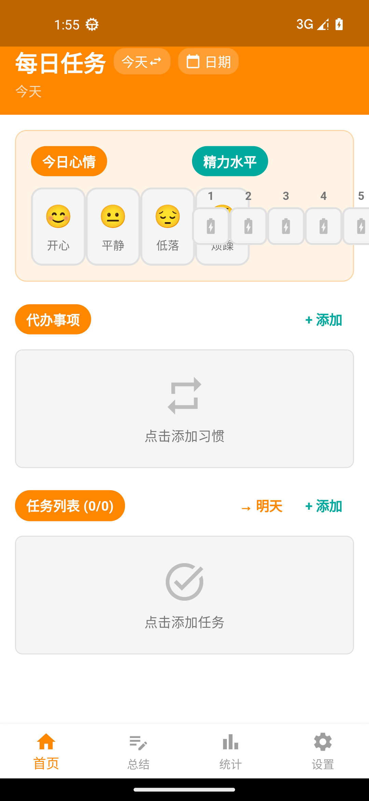
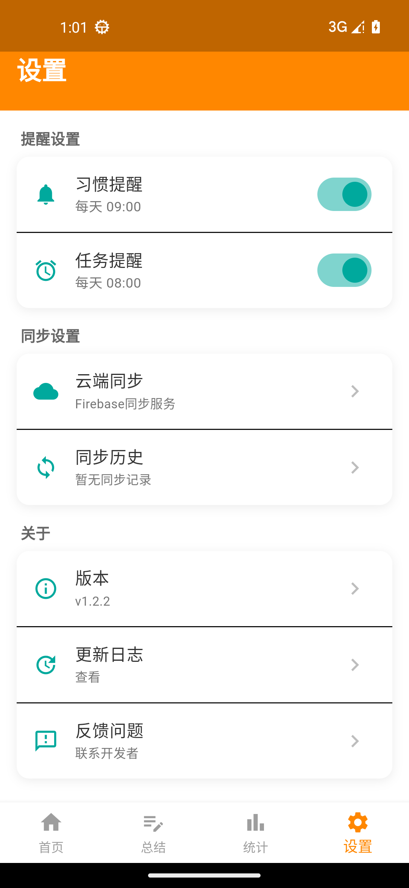
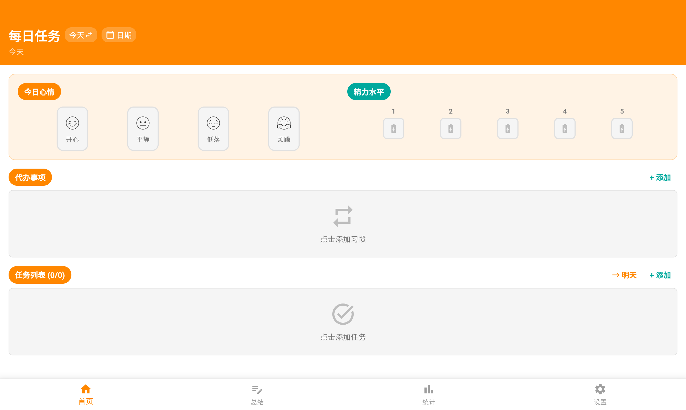

# Daily Life Manager (dailylifeapp)

> 每日任务与生活管理系统 | Flutter 跨端 + sqflite + Supabase 同步 | Provider 状态管理

## 💡 为什么做这个

我长期被三个问题困扰：

- **每天应该做什么** — 任务太多，不知从哪开始
- **时间都花在哪了** — 事情做了，但说不清做了什么
- **自己状态怎么样** — 心情 / 精力不记录，就看不出规律

`dailylifeapp` 是我用 Flutter 给自己的答案：把**每日任务 + 习惯打卡 + 日记 + 心情记录**装进一个 app，本地优先存储 + Supabase 云同步多端无缝。

> 这是一个**为自己做的真实工具**——不是作业、不是 demo，是想自己用下去的产品。
> 当前 MVP 阶段，主要功能已通，但还没有真实使用数据。

## 🎯 产品定位

`dailylifeapp` 是一个**个人生活管理 APP**，帮助用户统一管理日常任务、习惯打卡、日记、心情记录，**本地优先（sqflite）+ 云同步（Supabase）**，隐私与便利兼得。

## ✨ 5 大功能模块

- 📋 **任务管理**：每日任务添加 / 分类 / 完成状态跟踪
- 🔁 **习惯打卡**：自定义习惯 + 连续打卡天数统计
- 📔 **日记**：每日记录文字 + 心情
- 😊 **心情记录**：5 档心情选择 + 能量等级
- ☁️ **数据同步**：本地 sqflite + Supabase 云同步（多端无缝）

## 🛠️ 技术栈

| 层 | 技术 |
|---|---|
| 跨端框架 | Flutter 3.x（Dart 3.x）|
| 状态管理 | Provider 6.x |
| 本地存储 | sqflite 2.x |
| 云同步 | Supabase 2.x |
| 图表 | fl_chart |
| 工具 | intl / uuid / shared_preferences |

## 📱 跨端平台矩阵

> 按 **实际 build 过 / 跑过**的端勾选（非 pubspec platforms 段声明）

- ✅ **Android**（Pixel 5 模拟器 / API 33）
- ✅ **Web**（Chrome / Edge）
- ⚠️ iOS / Windows / macOS / Linux（Flutter 理论支持，本地未实测——没 Mac / 没时间）

## 🚀 快速开始

```bash
# 前置：Flutter SDK 3.24+ / Dart 3.x / Android Studio 或 Android SDK / Chrome 119+（跑 Web 端）

# 1. 克隆
git clone https://github.com/ma-chuannan/dailylifeapp.git
cd dailylifeapp

# 2. 安装依赖
flutter pub get

# 3. 跑起来
flutter run                # 默认 Android 模拟器
flutter run -d chrome      # Web 端（需要 Chrome 119+ 支持 WASM GC）
```

## 📸 截图

### Android

| 主界面 | 设置 |
|---|---|
|  |  |

*Pixel 5 模拟器 / API 33*

### Web

 *（Chrome 1280×800，主界面）*

## 🧪 测试

```bash
flutter test
```

当前 12 个 test 文件，~100 个 test case，覆盖所有 model + 关键 service。

## 📄 License

[MIT](LICENSE)
